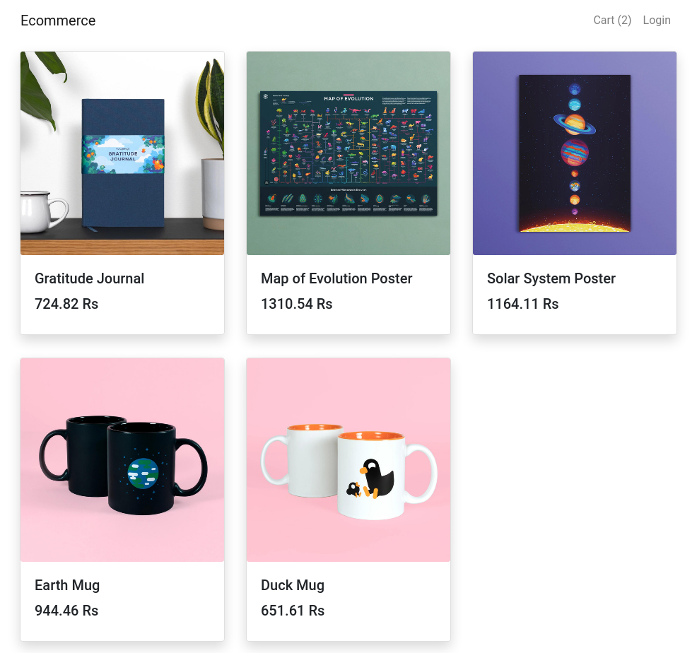

# ecommerce

> MERN stack app built with React context api and reducer

> [images](image.md)

# [demo]

[Heroku](https://pacific-temple-41001.herokuapp.com)

# Login info

`user email: test@mail.com`\
`user password: test@123`

`admin email: admin@mail.com`\
`admin password: admin@123`

# Features

- Full featured shopping cart
- Product reviews and ratings
- User profile with orders
- Admin product management
- Admin Order details page
- Mark orders as delivered option
- Checkout process (shipping, payment method, etc)
- Stripe integration

# Library used

- express
- react
- mongodb
- jwt (jsonwebtoken)
- formik
- react-bootstrap
- yup/joi
- stripe
- react-router-dom
- express-mongo-sanitize

# Build & Deploy

`npm run build` \
`npm run start`

# Env variable

| variable            | Usage                   |
| ------------------- | ----------------------- |
| REACT_APP_IMGBB     | image upload            |
| REACT_APP_STRIPEKEY | stripe public key       |
| JWTSECRET           | for genrating jwt token |
| STRIPT_SECRET_KEY   | stripe secret key       |
| MONGOURI            | mongodb instane url     |
